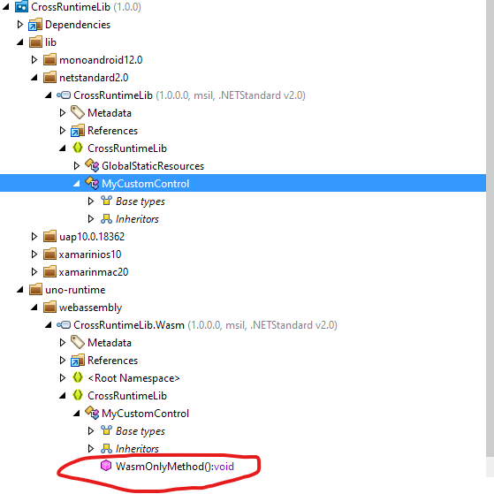
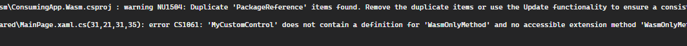

# Minimal repro for cross runtime library for WASM not picked up by WASM project

This project consists of two parts, one is the library, `CrossRuntimeLib`, another is the app consuming the library, `ConsumingApp`.

`CrossRuntimeLib` defines a WASM only method with the `__WASM__` guard, and as shown in the above screenshot via dotpeek, the WASM-only method is indeed in the binary for webassembly.

The `ConsumingApp` project has two heads, UWP and WASM. Only WASM is relevant here.

The WASM head references the `CrossRuntimeLib` nupkg (embeded in this minimal repro in `LocalPackages` for convenience). In `MainPage`, it tries to instantiate `MyCustomControl` and in a `__WASM__` guard calls the WASM only method. The project doesn't compile because the WASM only method is not found.

**Expected result**

The project compiles and the WASM only method is available in the `__WASM__` guard.

**Actual result**

The project doesn't compile.

**Note**

These kind of runtime/target-specific development works in all other targets, `uap`, `MonoAndroid`, etc. The build system can always pick up the correct binary in `lib` and runtime/target specific methods are callable. I'm not sure why the binary in `uno-runtime/webassembly` isn't picked up.

P.S. The template `unolib-crossruntime`'s `buildTransitive/$projectName.props` doesn't include `PackageBasePath` and the consuming app project complains if this is omitted. It's probably another bug.
